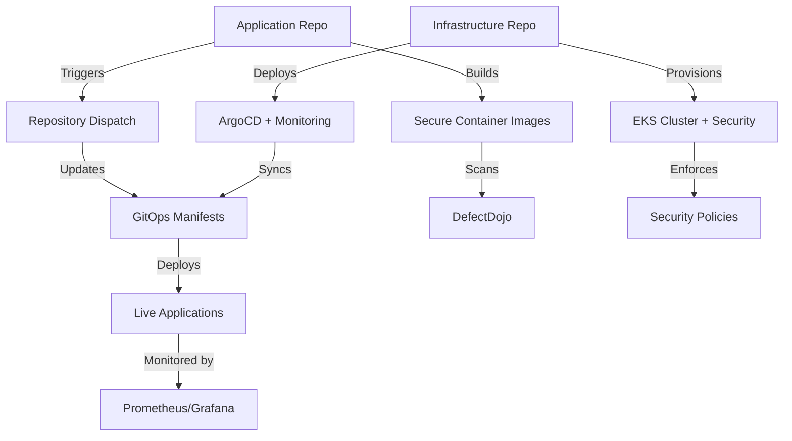

# End-to-End DevSecOps Platform

Complete DevSecOps ecosystem demonstrating security-first development practices with automated infrastructure, continuous integration, and GitOps deployment on Amazon EKS.

## 🎯 Project Overview

This project demonstrates how three specialized repositories integrate to form a complete end-to-end DevSecOps platform:

**Integration Philosophy**: Each repository serves a distinct purpose while seamlessly connecting through automated workflows, shared security policies, and unified monitoring to create a cohesive secure software delivery pipeline.

**End-to-End Flow**: Infrastructure provisions the secure foundation → Applications embed security throughout development → GitOps ensures compliant, auditable deployments → DefectDojo provides centralized vulnerability management across all layers.

**Key Integration Points**:
- **Automated Workflows**: Repository dispatch triggers connect application builds to GitOps deployments
- **Shared Security Context**: Common security policies, secrets management, and monitoring across all repos
- **Unified Observability**: Centralized logging, metrics, and vulnerability tracking spanning the entire pipeline
- **Policy Consistency**: Infrastructure-defined security constraints enforced at runtime through GitOps

## 🏗️ Architecture Overview

```
┌─────────────────────────────────────────────────────────────────────────────────┐
│                           🔄 DevSecOps Workflow                                 │
└─────────────────────────────────────────────────────────────────────────────────┘
                                      │
        ┌─────────────────────────────┼─────────────────────────────┐
        │                             │                             │
        ▼                             ▼                             ▼
┌─────────────────┐         ┌─────────────────┐         ┌─────────────────┐
│  📱 Application │         │ 🏗️ Infrastructure│         │  🔄 GitOps      │
│   Repository    │         │   Repository    │         │  Repository     │
│                 │         │                 │         │                 │
│ • Microservices │────────▶│ • EKS Cluster   │◀────────│ • Kustomize     │
│ • CI/CD Pipeline│         │ • Security Tools│         │ • ArgoCD Apps   │
│ • Security Scans│         │ • Monitoring    │         │ • Policies      │
│ • Image Build   │         │ • Networking    │         │ • Configs       │
└─────────────────┘         └─────────────────┘         └─────────────────┘
        │                             │                             ▲
        │                             │                             │
        └─────────────────────────────┼─────────────────────────────┘
                                      │
                              🚀 Automated Deployment
```

## 📁 Repository Structure

### **1. 🏗️ Infrastructure Repository** 
**[sec-eks-infra-automation](./sec-eks-infra-automation/)**

**Purpose**: Provisions and manages the entire AWS EKS infrastructure using Terraform

**Key Components**:
- **EKS Cluster**: Managed Kubernetes with fine-grained RBAC
- **Security Stack**: Vault, OPA Gatekeeper, Istio service mesh
- **Monitoring**: Prometheus, Grafana with custom dashboards
- **GitOps Engine**: ArgoCD for continuous deployment
- **AWS Integration**: Pod Identity, Load Balancer Controller, cert-manager

**Technologies**: Terraform, Helm, AWS EKS, AWS KMS, AWS Secrets Manager, HashiCorp Vault, Istio, OPA Gatekeeper, ArgoCD, Prometheus, Grafana, cert-manager, External Secrets Operator, GitHub Actions

### **2. 📱 Application Repository**
**[sec-online-boutique-appliation](./sec-online-boutique-appliation/)**

**Purpose**: Contains microservices source code with comprehensive security scanning

**Key Components**:
- **11 Microservices**: Go, Java, Python, Node.js, C# applications
- **Security Scanning**: SonarQube, Gitleaks, Snyk, Trivy integration
- **Container Security**: Multi-stage builds, distroless images
- **CI/CD Pipeline**: Automated testing, building, and security validation
- **DefectDojo Integration**: Vulnerability management and reporting

**Technologies**: Go, Java, Python, Node.js, C#, Docker, GitHub Actions, SonarQube, Gitleaks, Snyk, Trivy, DefectDojo, Multi-stage builds, Distroless images

### **3. 🔄 GitOps Repository**
**[sec-gitops-online-boutique](./sec-gitops-online-boutique/)**

**Purpose**: Manages Kubernetes deployments and configurations using GitOps principles

**Key Components**:
- **Kustomize Manifests**: Base configurations and environment overlays
- **Security Policies**: OPA Gatekeeper constraint templates
- **Cluster Resources**: Monitoring, networking, and security configurations
- **ArgoCD Applications**: Automated deployment definitions
- **DefectDojo Deployment**: Vulnerability management platform

**Technologies**: Kustomize, ArgoCD, Kubernetes, YAML, OPA Gatekeeper, Istio VirtualServices, Prometheus ServiceMonitors, Grafana Dashboards, External Secrets, DefectDojo Helm Charts

### **Technology Integration Matrix**

| Technology Category | Infrastructure | Application | GitOps | Integration Purpose |
|-------------------|---------------|-------------|--------|-----------------|
| **Infrastructure** | Terraform, AWS EKS, KMS | - | Kustomize, YAML | Infrastructure as Code foundation |
| **Security** | Vault, OPA, Istio | SonarQube, Gitleaks, Snyk, Trivy | OPA Policies, DefectDojo | End-to-end security pipeline |
| **Monitoring** | Prometheus, Grafana | - | ServiceMonitors, Dashboards | Unified observability |
| **Deployment** | ArgoCD, Helm | Docker, Multi-stage builds | ArgoCD Apps, Kustomize | GitOps continuous delivery |
| **Integration** | GitHub Actions | GitHub Actions, Repository Dispatch | GitHub Actions | Automated workflow orchestration |

## 🔄 Integration Workflow

### **Cross-Repository Integration Flow**



### **Three-Phase Integration Process**

#### **Phase 1: Foundation Establishment** *(Infrastructure Repository)*
**Flow**: `Terraform → AWS EKS → Security Stack → ArgoCD Bootstrap`

| Step | Component | Integration Impact |
|------|-----------|-------------------|
| **Cluster Creation** | EKS with Pod Identity, RBAC | Provides secure runtime environment for all workloads |
| **Security Foundation** | Vault, OPA Gatekeeper, Istio | Establishes security policies enforced across all deployments |
| **Monitoring Stack** | Prometheus, Grafana | Creates observability infrastructure for all repositories |
| **GitOps Engine** | ArgoCD with app definitions | Connects to GitOps repository for continuous deployment |

#### **Phase 2: Secure Development** *(Application Repository)*
**Flow**: `Code Commit → Security Scans → Container Build → Repository Dispatch`

| Step | Security Integration | Cross-Repo Impact |
|------|---------------------|-------------------|
| **SAST Scanning** | SonarQube, Gitleaks | Results aggregated in DefectDojo (deployed via GitOps) |
| **Dependency Scanning** | Snyk, Trivy | Vulnerability data flows to centralized DefectDojo |
| **Container Hardening** | Multi-stage builds, distroless images | Secure images consumed by GitOps manifests |
| **GitOps Trigger** | Repository dispatch | Automatically updates GitOps repository with new image tags |

#### **Phase 3: Compliant Deployment** *(GitOps Repository)*
**Flow**: `Manifest Update → ArgoCD Sync → Policy Validation → Deployment`

| Step | Integration Point | Security Enforcement |
|------|------------------|---------------------|
| **Manifest Updates** | Automated image tag updates | Triggered by Application repository CI/CD |
| **Policy Validation** | OPA Gatekeeper constraints | Enforces security policies defined in Infrastructure |
| **Service Mesh Integration** | Istio mTLS, authorization | Leverages security infrastructure from Infrastructure repo |
| **Monitoring Integration** | ServiceMonitors, dashboards | Connects to Prometheus/Grafana from Infrastructure repo |

### **Continuous Integration Cycle**
```
Developer Commit → Security Scans → Image Build → GitOps Update → ArgoCD Sync → 
Policy Enforcement → Deployment → Monitoring → Vulnerability Tracking → Feedback Loop
```

## 🔒 Cross-Repository Security Integration

### **Security Layer Integration Matrix**

| Security Layer | Primary Repo | Implementation | Integration with Other Repos |
|----------------|--------------|----------------|-----------------------------|
| **Code Security** | Application | SonarQube, Gitleaks, SAST | Results → DefectDojo (GitOps), Policies ← Infrastructure |
| **Container Security** | Application | Trivy, Snyk, distroless images | Images → GitOps manifests, Scans → DefectDojo |
| **Infrastructure Security** | Infrastructure | Pod Identity, KMS, VPC isolation | Policies → GitOps enforcement, Secrets → Application |
| **Runtime Security** | GitOps | OPA Gatekeeper, Istio mTLS | Policies ← Infrastructure, Enforcement → Applications |
| **Vulnerability Management** | All Repos | DefectDojo centralized platform | Aggregates findings from all security layers |

### **Integrated Security Automation**

| Security Practice | Implementation Across Repos | Integration Benefit |
|------------------|----------------------------|--------------------|
| **Shift-Left Security** | Application CI/CD → GitOps validation → Infrastructure enforcement | Early detection, consistent enforcement |
| **Policy as Code** | Infrastructure defines → GitOps implements → Application complies | Centralized policy management |
| **Secrets Management** | Infrastructure provisions Vault → GitOps configures External Secrets → Application consumes | Zero hardcoded secrets |
| **Zero-Trust Networking** | Infrastructure deploys Istio → GitOps configures policies → Application benefits from mTLS | Comprehensive network security |
| **Vulnerability Management** | All repos → DefectDojo aggregation → Centralized risk assessment | Unified security posture |
| **Continuous Monitoring** | Infrastructure monitoring → GitOps metrics → Application observability | End-to-end visibility |

## 🚀 Getting Started

### **Prerequisites**
- AWS Account with appropriate permissions
- GitHub repositories forked/cloned
- Terraform >= 1.5, kubectl, AWS CLI installed
- Domain configured in Route53 (optional)

### **Deployment Order**

1. **Deploy Infrastructure** (First)
   ```bash
   cd sec-eks-infra-automation
   # Configure terraform.tfvars
   terraform init && terraform apply
   ```

2. **Setup GitOps** (Second)
   ```bash
   # ArgoCD applications are deployed by infrastructure
   kubectl get applications -n argocd
   ```

3. **Deploy Applications** (Third)
   ```bash
   # Applications deploy automatically via GitOps
   # Or trigger manually from application CI/CD
   ```

### **Verification**
```bash
# Check cluster status
kubectl get nodes
kubectl get pods --all-namespaces

# Access services (port-forward for testing)
kubectl port-forward svc/argocd-server -n argocd 8080:443
kubectl port-forward svc/kube-prometheus-stack-grafana -n monitoring 3000:80
```

## 🛡️ Vulnerability Management with DefectDojo

### **Centralized Security Platform**
DefectDojo serves as the central vulnerability management platform across all three repositories:

- **Application Security**: Aggregates findings from SonarQube, Gitleaks, Snyk, and Trivy scans
- **Infrastructure Security**: Collects Terraform security scan results (tfsec, Checkov)
- **Runtime Security**: Monitors policy violations and security events
- **Reporting & Analytics**: Provides comprehensive security dashboards and metrics
- **Risk Management**: Prioritizes vulnerabilities and tracks remediation progress

### **Integration Points**
- **CI/CD Integration**: Automated security scan result ingestion
- **GitOps Deployment**: DefectDojo deployed and managed via ArgoCD
- **Secure Configuration**: Vault-managed credentials and Istio mTLS protection
- **Monitoring**: Prometheus metrics and Grafana visualization

## 📊 Monitoring & Observability

### **Comprehensive Observability Stack**
- **Metrics**: Prometheus with custom ServiceMonitors
- **Visualization**: Grafana dashboards for applications and infrastructure
- **Tracing**: Istio distributed tracing with Jaeger
- **Logging**: Structured logging (can be extended with Loki)
- **Security Monitoring**: DefectDojo vulnerability tracking and reporting

### **Key Dashboards**
- **Infrastructure**: EKS cluster, node, and pod metrics
- **Applications**: Microservices performance and health
- **Security**: Vulnerability trends and policy violations
- **GitOps**: ArgoCD deployment status and sync health

## 🛡️ Integrated Security Architecture

### **Defense in Depth Across Repositories**

| Security Layer | Infrastructure Repo | Application Repo | GitOps Repo | Integration Benefit |
|----------------|-------------------|------------------|-------------|--------------------|
| **Edge Security** | Route53, cert-manager, Let's Encrypt | - | Certificate resources, DNS configs | Automated SSL/TLS for all services |
| **Network Security** | Istio service mesh deployment | - | VirtualServices, authorization policies | Zero-trust networking with mTLS |
| **Runtime Security** | OPA Gatekeeper installation | - | Constraint templates, policy violations | Policy-as-code enforcement |
| **Data Security** | Vault with KMS auto-unsealing | - | External Secrets configuration | Centralized secret management |
| **Identity Security** | Pod Identity, RBAC configuration | - | Service account bindings | Fine-grained AWS access control |
| **Code Security** | - | SAST, secrets scanning, linting | - | Shift-left security practices |
| **Container Security** | - | Image scanning, hardened builds | Deployment policies | Secure container lifecycle |
| **Audit Security** | Monitoring infrastructure | Security scan results | Deployment audit logs | End-to-end audit trail |

### **Compliance & Governance Framework**
- **Policy Consistency**: Infrastructure defines → GitOps enforces → Applications comply
- **Access Control**: Centralized RBAC with repository-specific permissions
- **Audit Trail**: Git-based change tracking + Kubernetes audit logs + security scan history
- **Vulnerability Management**: DefectDojo aggregates findings from all security layers
- **Continuous Compliance**: Automated policy validation at every deployment stage

## 🔧 Cross-Repository Customization

### **Adding New Microservices**

| Step | Repository | Action | Integration Impact |
|------|------------|--------|--------------------|
| **1** | Application | Add service code, Dockerfile, CI/CD workflow | Triggers security scanning and image building |
| **2** | GitOps | Create Kustomize manifests, service configs | Defines deployment and networking rules |
| **3** | Infrastructure | Update monitoring, add security policies (if needed) | Extends observability and security coverage |
| **4** | Integration | Repository dispatch connects App → GitOps | Enables automated deployments |

### **Environment Management Strategy**

| Environment | Infrastructure Config | Application Config | GitOps Config | Integration Pattern |
|-------------|---------------------|-------------------|---------------|--------------------|
| **Development** | Single AZ, minimal nodes | Single replica, basic resources | Dev overlay, relaxed policies | Direct GitOps sync |
| **Staging** | Multi-AZ, production-like | Multi-replica, production resources | Staging overlay, strict policies | Manual promotion |
| **Production** | HA, auto-scaling | HA, optimized resources | Production overlay, full security | Approval-based deployment |

### **Security Policy Management**

| Policy Type | Definition Location | Implementation | Enforcement | Cross-Repo Impact |
|-------------|-------------------|----------------|-------------|-------------------|
| **OPA Constraints** | GitOps repo templates | Gatekeeper admission controller | Runtime validation | Affects all deployments |
| **Network Policies** | GitOps repo manifests | Kubernetes NetworkPolicy | Pod-to-pod communication | Controls service mesh traffic |
| **RBAC Policies** | Infrastructure repo | EKS API access entries | Cluster access control | Governs all repository operations |
| **Security Scanning** | Application repo configs | CI/CD pipeline integration | Build-time validation | Feeds DefectDojo across all repos |

## 🤝 Contributing

Each repository has its own contribution guidelines:
- **Infrastructure**: Terraform modules and AWS resource management
- **Application**: Microservices development and security scanning
- **GitOps**: Kubernetes manifests and deployment configurations

## 📚 Documentation

- **[Infrastructure README](./sec-eks-infra-automation/README.md)** - Complete infrastructure setup guide
- **[Application README](./sec-online-boutique-appliation/README.md)** - Microservices and CI/CD details
- **[GitOps README](./sec-gitops-online-boutique/README.md)** - Deployment and configuration management

## 🔗 Related Resources

- [AWS EKS Best Practices](https://aws.github.io/aws-eks-best-practices/)
- [CNCF Security Whitepaper](https://github.com/cncf/sig-security/blob/master/security-whitepaper/CNCF_cloud-native-security-whitepaper-Nov2020.pdf)
- [GitOps Principles](https://opengitops.dev/)
- [DevSecOps Best Practices](https://www.devsecops.org/)

## 📄 License

This project is licensed under the MIT License - see individual repository LICENSE files for details.

---

**🌟 This project demonstrates enterprise-grade DevSecOps practices with security, automation, and observability built-in from day one.**

**Built with ❤️ for DevSecOps education and demonstration**